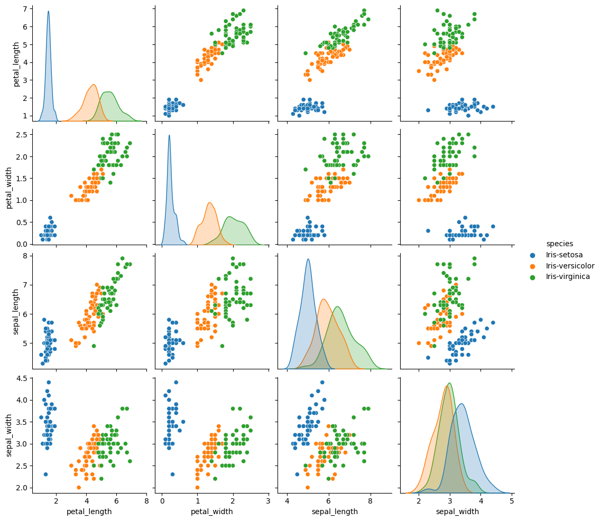
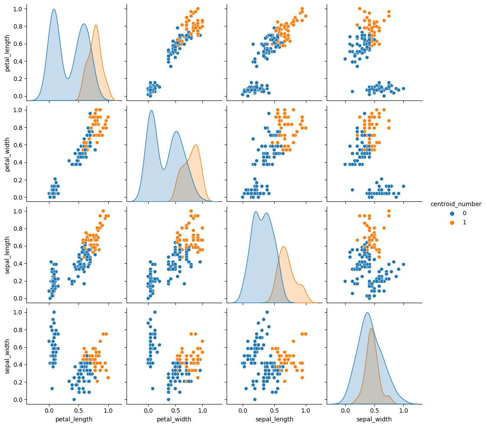
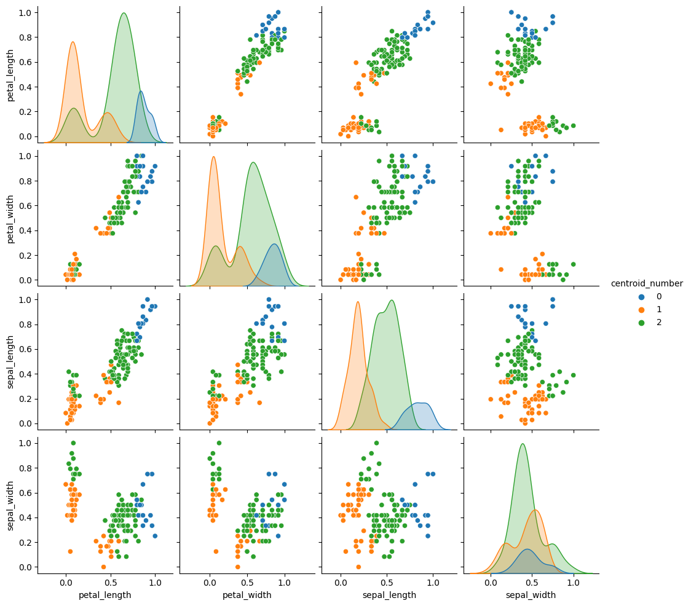
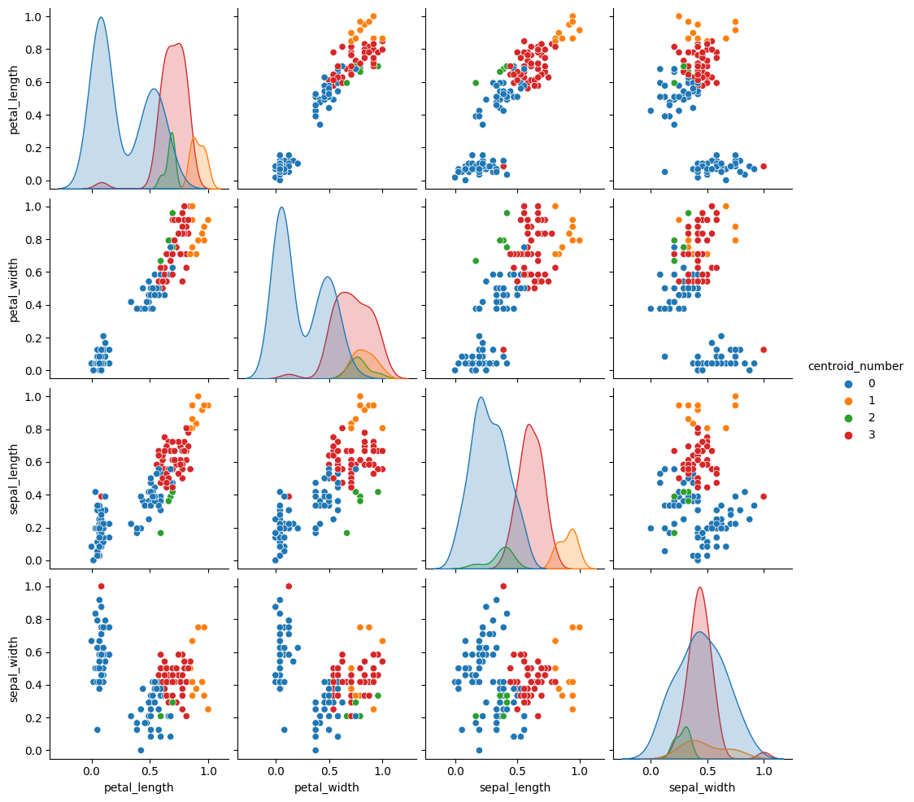
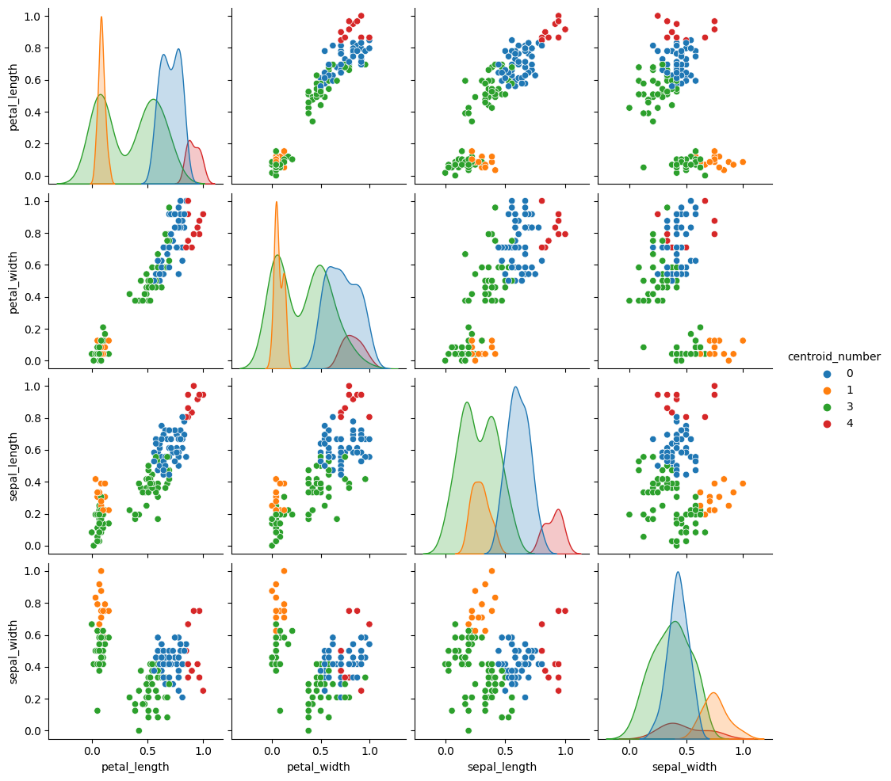

# Informe

## Descripción del problema

Para este proyecto se solicitó efectuar la implementación del algoritmo *k-means* para clustering en pro de generar un categorizador
multiclase impulsado por aprendizaje no supervisado. 

## Implementación

La implementación del algoritmo se puede encontrar en la clase `KMeans` ubicada en el archivo `K_Means.py`. La clase permite especificar
el conjunto de datos a utilizar en la ejecución del algoritmo y el número de clases deseadas. Dada la simpleza general del algoritmo la
implementación presentada en este proyecto no cuenta con mayor cantidad de peculiaridades o características destacables. 

## Descripción de los datos y pre-procesamiento

Se solicitó realizar la ejecución del algoritmo *k-means* sobre dos sets de datos:

### Dataset Iris

Mismo dataset empleado para el entrenamiento de la red neuronal en el Proyecto 2. contiene información sobre 150 plantas pertenecientes al género iris. Cada una de las plantas descritas, a su vez, pertence a alguna de las siguientes 3 clases dentro del género:

* Iris Setosa
* Iris Versicolor 
* Iris Virginica 

Y sobre cada planta en el dataset se tienen los siguientes datos: 

* Longitud del sépalo de la planta 
* Anchura del sépalo de la planta 
* Longitud del pétalo de la planta 
* Anchura del pétalo de la planta 

Para poder ejecutar el algoritmo bajo este dataset fue necesario efectuar previamente una normalización de los datos. Esto se debe a que la presencia de atributos de distinta dimensionalidad causa variaciones en la medición de las distancias a cada centroide que terminan perjudicando el desempeño del algoritmo.

### Segmentación de imágenes

Para la segunda fase de experimentación no se proveyó un dataset particular, en su lugar, se tiene el propósito de aplicar el algoritmo de *k-means* para el propósito de segmentación de imágenes. De esta manera, los datasets para la segunda fase de experimentación consisten en la agregación de los valores RGB de cada pixel para cada una de las imágenes procesadas. A diferencia del dataset iris los conjuntos de datos generados a partir de las imágenes no requirieron normalización, dado que para cada pixel los valores RGB siempre oscilan entre 0 y 255. 

## Experimento 1: Set Iris

Para el primer experimento se aplicó el algoritmo k-means sobre el dataset iris para valores de k entre 2 y 5 (Ambos inclusive), con el propósito de comparar
las clases generadas por el algoritmo con las categorizaciones reales de los datos. Para cada una de las ejecuciones se puso una cota máxima de 1000 iteraciones, y como estipula el algoritmo, la ubicación inicial de los centroides se elige de manera aleatoria. En pro de facilitar la compración, a continuación adjuntamos el diagrama de pares del conjunto de datos original:

A continuación presentamos los diagramas equivalentes para cada una de las categorizaciones alcanzadas por el algoritmo para los distintos valores de k:

### k = 2

### k=3

### k=4

### k=5

En general, ninguna de las categorizaciones obtenidas por el algoritmo se asemeja lo suficiente a la categorización original de los datos como para poder
presentarlas comom acertadas. En particular nos interesa resaltar la categorización alcanzada para k=3, donde la comparación resulta más directa entre ambos diagramas. El diagrama original del conjunto de datos muestra picos muchos más concentrados y una distinción mucho más acentuada entre las distintas categorías; por el otro lado la categorización alcanzada por el algoritmo muestra una separación mucho más ambigua y una cantidad considerable de sobreposición en las diferentes gráficas. También destaca la muy acentuada presencia de la categoría número 2 (verde) por encima de las demás categorías, cosa que no se aprecia en el diagrama original.

También destacable de esta ronda de experimentación fue el diagrama generado para el caso k=5, donde la categoría número 2 terminó desapareciendo completamente del panorama de categorización. Una ejecución posterior utilizando k=6 mostró un comportamiento bastante similar, con únicamente 4 categorías siendo mostradas en el resultado final. De aquí podríamos, aunque no de manera decisiva, asomar la posibilidad de que el set de datos tiende naturalmente a un máximo de 4 categorizaciones al someterlo al algoritmo; sin embargo, serían necesarias pruebas adicionales para poder sacar alguna conclusión al respecto.
