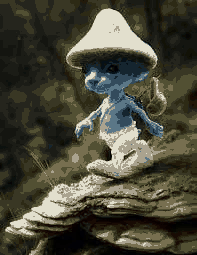

# Informe

## Descripción del problema

Para este proyecto se solicitó efectuar la implementación del algoritmo *k-means* para clustering en pro de generar un categorizador
multiclase impulsado por aprendizaje no supervisado. 

## Implementación

La implementación del algoritmo se puede encontrar en la clase `KMeans` ubicada en el archivo `K_Means.py`. La clase permite especificar
el conjunto de datos a utilizar en la ejecución del algoritmo y el número de clases deseadas. Dada la simpleza general del algoritmo la
implementación presentada en este proyecto no cuenta con mayor cantidad de peculiaridades o características destacables. 

## Descripción de los datos y pre-procesamiento

Se solicitó realizar la ejecución del algoritmo *k-means* sobre dos sets de datos:

### Dataset Iris

Mismo dataset empleado para el entrenamiento de la red neuronal en el Proyecto 2. contiene información sobre 150 plantas pertenecientes al género iris. Cada una de las plantas descritas, a su vez, pertence a alguna de las siguientes 3 clases dentro del género:

* Iris Setosa
* Iris Versicolor 
* Iris Virginica 

Y sobre cada planta en el dataset se tienen los siguientes datos: 

* Longitud del sépalo de la planta 
* Anchura del sépalo de la planta 
* Longitud del pétalo de la planta 
* Anchura del pétalo de la planta 

Para poder ejecutar el algoritmo bajo este dataset fue necesario efectuar previamente una normalización de los datos. Esto se debe a que la presencia de atributos de distinta dimensionalidad causa variaciones en la medición de las distancias a cada centroide que terminan perjudicando el desempeño del algoritmo.

### Segmentación de imágenes

Para la segunda fase de experimentación no se proveyó un dataset particular, en su lugar, se tiene el propósito de aplicar el algoritmo de *k-means* para el propósito de segmentación de imágenes. De esta manera, los datasets para la segunda fase de experimentación consisten en la agregación de los valores RGB de cada pixel para cada una de las imágenes procesadas. A diferencia del dataset iris los conjuntos de datos generados a partir de las imágenes no requirieron normalización, dado que para cada pixel los valores RGB siempre oscilan entre 0 y 255. 

## Experimento 1: Set Iris

Para el primer experimento se aplicó el algoritmo k-means sobre el dataset iris para valores de k entre 2 y 5 (Ambos inclusive), con el propósito de comparar
las clases generadas por el algoritmo con las categorizaciones reales de los datos. Para cada una de las ejecuciones se puso una cota máxima de 1000 iteraciones, y como estipula el algoritmo, la ubicación inicial de los centroides se elige de manera aleatoria. En pro de facilitar la compración, a continuación adjuntamos el diagrama de pares del conjunto de datos original:

A continuación presentamos los diagramas equivalentes para cada una de las categorizaciones alcanzadas por el algoritmo para los distintos valores de k:

### k = 2

### k=3

### k=4

### k=5

En general, ninguna de las categorizaciones obtenidas por el algoritmo se asemeja lo suficiente a la categorización original de los datos como para poder
presentarlas comom acertadas. En particular nos interesa resaltar la categorización alcanzada para k=3, donde la comparación resulta más directa entre ambos diagramas. El diagrama original del conjunto de datos muestra picos muchos más concentrados y una distinción mucho más acentuada entre las distintas categorías; por el otro lado la categorización alcanzada por el algoritmo muestra una separación mucho más ambigua y una cantidad considerable de sobreposición en las diferentes gráficas. También destaca la muy acentuada presencia de la categoría número 2 (verde) por encima de las demás categorías, cosa que no se aprecia en el diagrama original.

También destacable de esta ronda de experimentación fue el diagrama generado para el caso k=5, donde la categoría número 2 terminó desapareciendo completamente del panorama de categorización. Una ejecución posterior utilizando k=6 mostró un comportamiento bastante similar, con únicamente 4 categorías siendo mostradas en el resultado final. De aquí podríamos, aunque no de manera decisiva, asomar la posibilidad de que el set de datos tiende naturalmente a un máximo de 4 categorizaciones al someterlo al algoritmo; sin embargo, serían necesarias pruebas adicionales para poder sacar alguna conclusión al respecto.

## Experimento 2: Segmentación de imágenes

Para el segundo experimento se aplicó el algoritmo de k-means sobre conjuntos de datos conteniendo, para 2 imágenes escogidas por el equipo, la información de los canales RGB para cada uno de sus pixeles. Con la categorización resultante de la aplicación del algoritmo se generaron posteriormente réplicas de las imágenes originales con paletas de colores determinadas por las categorías obtenidas (De esta forma, si se ejecutó el algoritmo con un valor de k=x, la imagen resultante estaría en una paleta de x colores). Dado que la imágenes generan conjunto de datos de tamaño considerable, se limitó la cota de iteraciones para cada ejecución del algoritmo a 30 iteraciones. A contuniación presentamos, para cada imagen, la imagen original y las réplicas obtenidas para cada ejecución del algoritmo

### Imagen 1

Imagen original:

Primer renderizado, k=15:

Segundo renderizado, k=20:

Tercer renderizado, k=30:

Cuarto renderizado, k=50:

Quinto renderizado, k=64:

### Imagen 2

Imagen original:

Primer renderizado, k=8:

Segundo renderizado, k=16:

Tercer renderizado, k=32:

Cuarto renderizado, k=50:

Quinto renderizado, k=64:

De manera general, las imágenes generadas por el algoritmo cuentan con un nivel de similitud satisfactorio al compararlos con la fuente original, en especial en los renderizados obtenidos con números más elevados de clusters. Sin embargo, también es evidente que a medida que el valor de k va aumentando nos vamos acercando a un punto de rendimientos decrecientes. Particularmente, es difícil discernir a simple vista alguna diferencia entre el renderizado de k=50 y el de k=64 para la imagen 1; e incluso en la imagen 2, que cuenta con una variedad mucho mayor de colores y tonos, la diferencia para k=50 y k=64 no pareciera ser más significativa que una diferencia ligera en saturación. Esto dicho, se considera que el algoritmo tuvo un desempeño competente al momento de recolorizar las imágenes proveídas.

## Conlusiones

Tras la observación y análisis de los resultados obtenidos a partir de las diferentes rondas de experimentación, se pudo concluir que el *Clustering* y el algorimto de *k-means*, aunque perfectamente capaces de efectuar tareas de clasificación; no se adecúan de manera óptima a todos los problemas de esta naturaleza. Más específicamente, del primer experimento se pudo extraer que el algoritmo tiende a encontrarse con dificultades al momento de categorizar datos de clases conocidas, reducidas y específicas. Por el otro lado, el segundo experimento demostró que las capacidades de categorización del algoritmo *k-means* son suficientes y adecuadas para tareas de clasificación donde errores de categorización ligeros no afectan la calidad del resultado final (Como, por ejemplo, distinguir erróneamente entre dos tonalidades de verde). De esta manera, se concluye que el algoritmo *k-means* se desempeña de manera óptima en problemas vinculados a grandes volúmenes de datos donde la exactitud de la categorización no es crucial para la obtención de una solución suficiente.